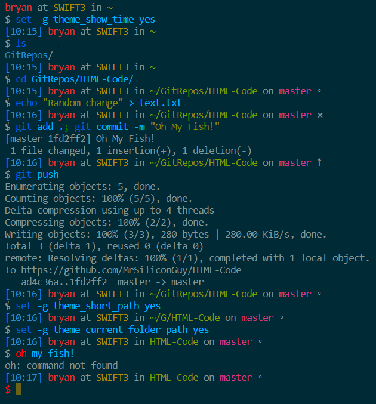

<div align="center">
  <a href="http://github.com/fish-shell/omf">
  
  </a>
</div>
<br>
<p align="center">
  <a href="https://github.com/oh-my-fish/oh-my-fish" alt="Oh My Fish">
    </a>
  <a href="/LICENSE" alt="Oh My Fish">
    </a>
</p>

> A simple, git-aware, two-line theme for [Oh My Fish][omf-link]. Based off of [simple-ass-prompt](https://github.com/lfiolhais/theme-simple-ass-prompt), optimized for [solarized](https://ethanschoonover.com/solarized/).

## Install

```fish
$ omf theme solarfish
```

## Features

- Easily readable prompt
- Long, short, and current folder directory options
- Git repository status:
  - ahead "↑"
  - behind "↓"
  - diverged "⥄ "
  - dirty "⨯"
  - none "◦"
- Command line timestamp (configurable)
- Previous command status
- Special greeting prompt if `cowsay` is installed!

## Screenshot

<p align="center">

</p>

## Configuration

Add any of the following lines to
`~/.config/fish/config.fish`

```fish
# Display the timestamp in the prompt
set -g theme_show_time yes

# Use a short directory path name
set -g theme_short_path yes

# Display only the current folder name
set -g theme_current_folder_path yes
```

# License

[MIT][mit] © [Bryan C][author]

[mit]: http://opensource.org/licenses/MIT
[author]: http://github.com/MrSiliconGuy
[omf-link]: https://www.github.com/fish-shell/oh-my-fish
[license-badge]: https://img.shields.io/badge/license-MIT-007EC7.svg?style=flat-square
[travis-badge]: http://img.shields.io/travis/oh-my-fish/theme-default.svg?style=flat-square
[travis-link]: https://travis-ci.org/oh-my-fish/theme-default
